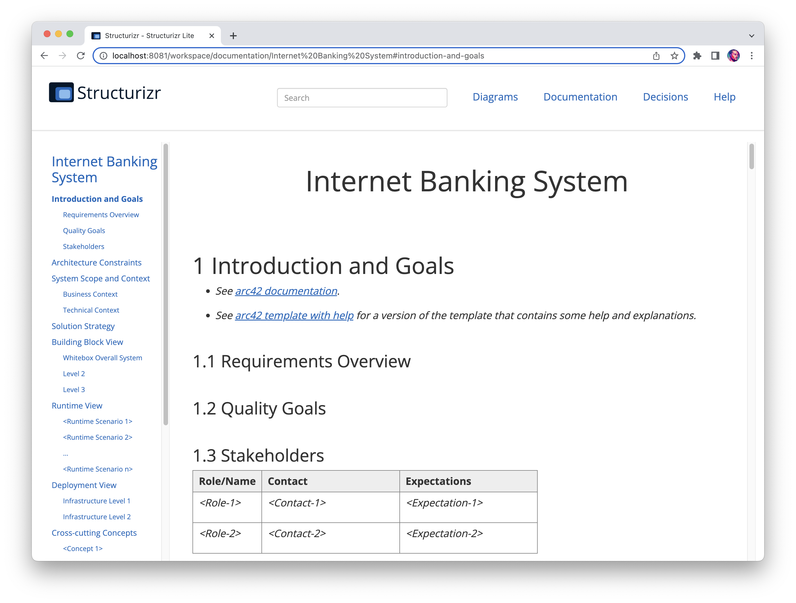

# A minimal approach to software architecture documentation

> The question of "how much documentation should we write?" is popping up a lot recently, probably driven by teams looking
at their business continuity plans, and the increase in remote working.

This is an implementation example of the
approach [proposed by Simon Brown](https://dev.to/simonbrown/a-minimal-approach-to-software-architecture-documentation-4k6k). Remembering that time is precious, the
approach has only three parts:
1. Software architecture models as code built with [Structurizr Lite](https://github.com/structurizr/lite)
2. Documentation built with [Arc42 template](https://arc42.org/overview)
3. Decision log built with [ADR Tools](https://github.com/npryce/adr-tools)

It's intended to store this documentation in a repository and treat it the same as code.



### 1. Software architecture models as code

[Structurizr](https://structurizr.com/) builds upon "diagrams as code", allowing you to create *multiple software
architecture diagrams* from a *single model*.
There are a number of tools for creating Structurizr compatible workspaces, with
the [Structurizr DSL](https://github.com/structurizr/dsl)
being the recommended option for most teams.
This Structurizr DSL example creates two diagrams, based upon a single set of elements and relationships.

---

```
workspace {

    model {
        user = person "User"
        softwareSystem = softwareSystem "Software System" {
            webapp = container "Web Application" {
                user -> this "Uses"
            }
            container "Database" {
                webapp -> this "Reads from and writes to"
            }
        }
    }

    views {
        systemContext softwareSystem {
            include *
            autolayout lr
        }

        container softwareSystem {
            include *
            autolayout lr
        }

        theme default
    }
```

---


---


### 2. Documentation

Because the code doesn't tell the whole story, Structurizr provides support for lightweight supplementary technical
documentation. The documentation is a collection of Markdown or AsciiDoc files, one per section, which are rendered in
the web browser. [Arc42](https://arc42.org/overview) template is used for the documentation.


### 3. Decision log

Because diagrams alone can't express the decisions that led to a solution, Structurizr allows you to supplement your
software architecture model with a decision log,
captured as a collection of lightweight Architecture Decision Records (ADRs)
[as described by Michael Nygard](https://cognitect.com/blog/2011/11/15/documenting-architecture-decisions),
and featured on
the [ThoughtWorks Technology Radar](https://www.thoughtworks.com/radar/techniques/lightweight-architecture-decision-records).
Structurizr allows you to publish your ADRs to allow team members get an "at a glance" view of the current set of ADRs,
along with facilities to make navigating them easier.

## How to run

- `docker compose up -d`
- Open web browser and go to [`http://localhost:8081/`](http://localhost:8081/)

## How to use Structurizr Lite

- Check [`http://localhost:8081/workspace/diagrams`](http://localhost:8081/workspace/diagrams) for diagrams
- Check [`http://localhost:8081/workspace/documentation/Internet%20Banking%20System`](http://localhost:8081/workspace/documentation/Internet%20Banking%20System)
for documentation
- Check [`http://localhost:8081/workspace/decisions/Internet%20Banking%20System`](http://localhost:8081/workspace/decisions/Internet%20Banking%20System)
for [ADRs](https://github.com/npryce/adr-tools)
- Check [language reference](https://github.com/structurizr/dsl/blob/master/docs/language-reference.md) for dsl syntax
- Check [Getting started with Structurizr Lite](https://dev.to/simonbrown/getting-started-with-structurizr-lite-27d0)
  for more details
- Watch two talks at the bottom of the [C4 FAQ](https://c4model.com/#FAQ)

##

- [Arc42](https://arc42.org/overview) docs are in `internet-banking-system/docs`
- [ADRs](https://github.com/npryce/adr-tools) are in `internet-banking-system/adrs`

## docToolChain

[docToolChain](https://github.com/docToolchain/docToolchain) is an implementation of the docs-as-code approach for
software architecture. The basis of docToolchain is the philosophy that software documentation should be treated in the
same way as code together with the arc42 template for software architecture.


## Notes for Confluence users

- If you consider to use confluence, the [asciidoc2confluence](https://github.com/rdmueller/asciidoc2confluence) script
  might be helpful.